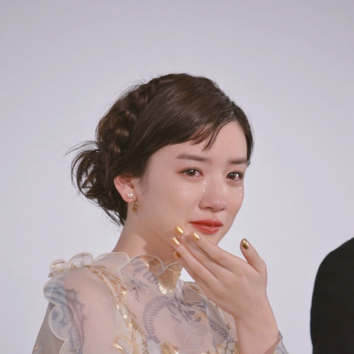
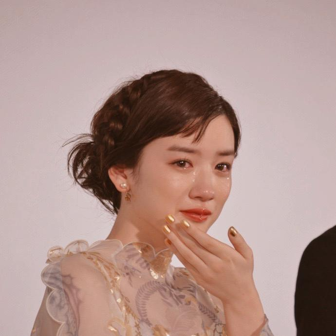

# Technicolor Filter

Technicolor is a series of color motion picture processes, the first version dating to 1916, and followed by improved versions over several decades. Classic films like *The Wizard of Oz*, *Gone with the Wind*, and *Snow White and the Seven Dwarfs* are all made with technicolor. Technicolor uses comibination of cyan, magenta, and yellow to create colors and filmmakers can use different variations of the tree colors to produce different images. This package try to recreate that process and allows you to use differen shades of cyan, magenta, and yellow to edit your own picture.

To learn more about technicolor: [Technicolor Wikipedia Page](https://en.wikipedia.org/wiki/Technicolor), [Video by Vox](https://www.youtube.com/watch?v=Mqaobr6w6_I&t=517s)

## Installation

Python3 and numpy is required.

To install, run the following command

``` bash
git clone git@github.com:thoughtp0lice/technicolor_filter.git
cd technicolor_filter
pip3 install .
```

## Usage

Here is a script to edit `example/person.jpg` with Process cyan, Process magenta, and Process yellow

```python
import technicolor_filter as tech
img = tech.read_image('example_pics/person.jpg')
img.set_all_color(['Process cyan', 'Process magenta', 'Process yellow'])
img.show()
```

## Example

Here is some pictures made from technicolor_filter
|Original Image|With Pocess (cyan+magenta+yellow)|With Cyan + Red|
|--------------|---------------------------------|---------------|
|||
